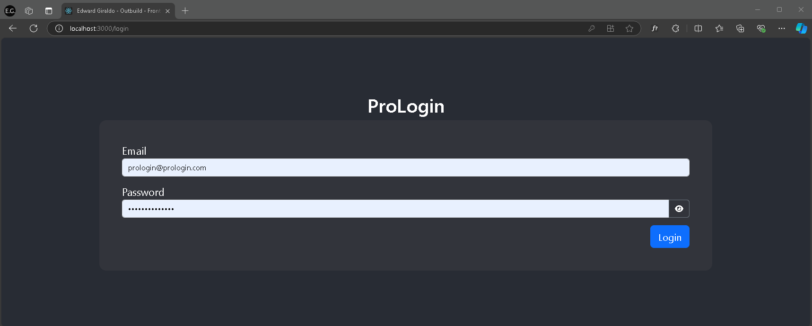
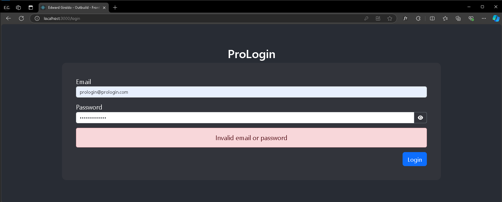
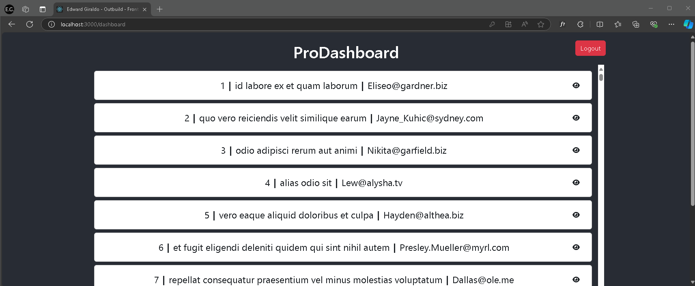
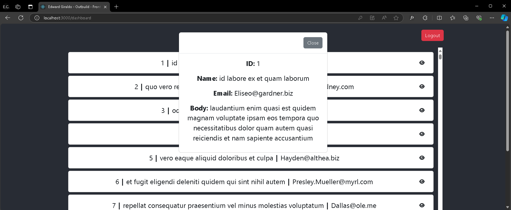

# Proplanner - Frontend App

This application simulates a Login view and a Dashboard in React, displaying comments fetched from an API. A login is required to access the Dashboard.

## How to Run the Project

### Available Scripts

In the project directory, you can run:

### npm start

Runs the app in development mode.
Open http://localhost:3000 to view it in your browser.

The page will reload if you make edits.
You will also see any lint errors in the console.

### npm run build

Builds the app for production in the build folder.
It correctly bundles React in production mode and optimizes the build for the best performance.

## Login Credentials

### Username: prologin@prologin.com

### Password: ProLogin123456

## Main Technologies Used

### React: Library for building the user interface.

### Bootstrap: Framework for styling and responsive design.

### Axios: HTTP client for API calls.

### Font Awesome: Icon library.

## Screenshots

### Login Screen:

### Login Screen validation:

### Login Screen password visualization:

### Dashboard Screen displaying comments:

### Modal to view comment details:

